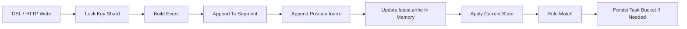
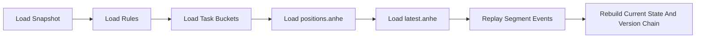
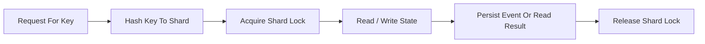
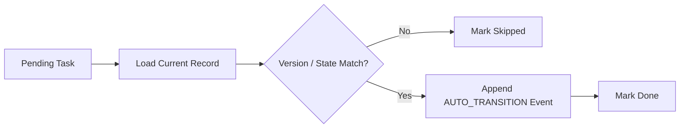
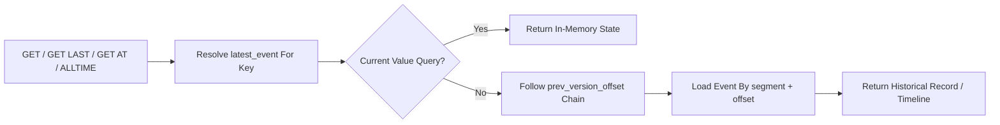
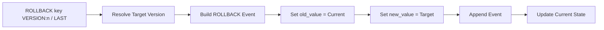
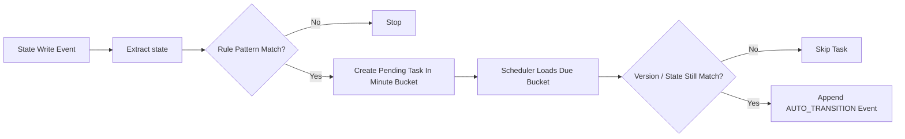

<h1 align="center">AnheBridgeDB</h1>

<p align="center">
  Evented KV store with version history, rollback, DSL, and rule-driven state transitions.
</p>

<p align="center">
  
</p>

<p align="center">
  <strong>Timeline. Diff. Rollback. Auto-transition.</strong>
</p>

<p align="center">
  <a href="https://github.com/paerx/anhebridgeDB">Live Demo</a>
  ·
  <a href="https://github.com/paerx/anhebridgeDB">DSL Playground</a>
  ·
  <a href="https://github.com/paerx/anhebridgeDB">Docs</a>
  ·
  <a href="https://github.com/paerx/anhebridgeDB">API</a>
</p>

## Overview

AnheBridgeDB v1 covers the current MVP path described in `docs/`:

- append-only segmented event log with old/new values and version chain
- current-state index + historical timeline reconstruction
- `GET key`, `GET key AT ts`, `GET key ALLTIME`, `GET key ALLTIME WITH DIFF`
- `ROLLBACK key VERSION:n` and `ROLLBACK key VERSION:LAST`
- DSL parser and execution endpoint
- rule engine with `CREATE RULE ... IF UNCHANGED FOR ... THEN TRANSITION`
- bucket-style persisted task queue and scheduler-driven auto transition
- snapshot + restart recovery for state, rules, and pending tasks

## Run

```bash
go run ./cmd/server -addr :8080 -data ./data -scheduler-interval 1s
```

Segment rolling is configurable in [config.json](/Users/pangaichen/Desktop/AnheBridageDB/config/config.json):

```json
{
  "storage": {
    "segment": {
      "max_bytes": 67108864,
      "max_records": 30000
    }
  }
}
```

Both thresholds can be enabled together. A segment rolls when either limit is exceeded.

Client:

```bash
go run ./cmd/client -addr http://127.0.0.1:8080
```

Single command:

```bash
go run ./cmd/client -addr http://127.0.0.1:8080 -e 'GET user:1 ALLTIME WITH DIFF;'
```

Pipe input:

```bash
printf 'SHOW RULES;\n' | go run ./cmd/client -addr http://127.0.0.1:8080
```

Stress test:

```bash
go run ./cmd/stress -addr http://127.0.0.1:8080 -mode rw -duration 60s -workers 16 -batch 64 -keys 20000
go run ./cmd/stress -addr http://127.0.0.1:8080 -mode orders -orders 20000 -order-batch 200 -workers 8 -rule-delay 15s
go run ./cmd/stress -addr http://127.0.0.1:8080 -mode mixed -duration 90s -workers 16 -orders 10000
```

For an M4 / 16GB machine, a practical starting point is:

```bash
go run ./cmd/server -addr :8080 -data ./data -scheduler-interval 500ms
go run ./cmd/stress -addr http://127.0.0.1:8080 -mode mixed -duration 120s -workers 16 -batch 128 -keys 50000 -orders 20000 -order-batch 200 -rule-delay 15s
```

## API

Write:

```bash
curl -X PUT http://localhost:8080/kv/user:1 \
  -H 'Content-Type: application/json' \
  -d '{"name":"tom","state":"active"}'
```

Read latest:

```bash
curl http://localhost:8080/kv/user:1
```

Read at time:

```bash
curl 'http://localhost:8080/kv/user:1?time=2026-03-14T03:00:00Z'
```

Timeline:

```bash
curl http://localhost:8080/kv/user:1/timeline
```

Timeline with diff:

```bash
curl 'http://localhost:8080/kv/user:1/timeline?diff=true'
```

Delete:

```bash
curl -X DELETE http://localhost:8080/kv/user:1
```

Create snapshot:

```bash
curl -X POST http://localhost:8080/snapshot
```

Stats:

```bash
curl http://localhost:8080/stats
```

Create rule:

```bash
curl -X POST http://localhost:8080/rules \
  -H 'Content-Type: application/json' \
  -d '{
    "id":"auto_timeout_order",
    "pattern":"OrderStatus:*:wait_for_paid",
    "delay":"15m",
    "target":"OrderStatus:{id}:timeout"
  }'
```

Execute DSL:

```bash
curl -X POST http://localhost:8080/dsl \
  -H 'Content-Type: application/json' \
  -d '{
    "query":"SET OrderStatus:123 {\"state\":\"wait_for_paid\",\"amount\":100}; GET OrderStatus:123 ALLTIME WITH DIFF;"
  }'
```

## Data Layout

```text
data/
  log/segment_000001.anhe
  log/segment_000002.anhe
  index/positions.anhe
  index/latest.anhe
  snapshot/latest.json
  system/rules.json
  system/task_buckets/202603140445.anhe
  system/task_buckets/202603140446.anhe
```

## Storage Model

AnheBridgeDB stores data as an append-only event stream plus a small set of persisted indexes:

- `log/segment_xxxxxx.anhe`
  - append-only event segments
  - each event stores `event_id`, `key`, `operation`, `old_value`, `new_value`, `prev_version_offset`, and metadata
- `index/positions.anhe`
  - persistent position index
  - maps `event_id -> segment + file offset + size`
- `index/latest.anhe`
  - persistent latest-version index
  - maps `key -> latest_event`
- `snapshot/latest.json`
  - full state snapshot for restart recovery
- `system/rules.json`
  - rule definitions and counters
- `system/task_buckets/*.anhe`
  - minute-bucket task files for delayed transitions

### Write Path



### Recovery Path



## Locking Model

The runtime uses sharded key locks instead of a single global KV lock:

- the same key is always serialized
- different keys can be read and written in parallel
- batch operations lock involved key shards in sorted order to avoid deadlocks
- event log append is serialized internally so `event_id` ordering stays stable
- metadata persistence such as `latest.anhe` save is serialized separately

### Lock Flow



## Idempotency Model

The rule engine is designed around version checks, not blind timers.

- each scheduled task stores:
  - `entity_key`
  - `expected_version`
  - `expected_state`
  - `cause_event_id`
- when the scheduler executes a task, it first validates that the current record still matches the captured version and state
- if the key has changed since task creation, the task is marked `skipped`
- if the key is unchanged, a new `AUTO_TRANSITION` event is appended

This makes delayed transitions naturally idempotent at the state-machine level.

### Idempotent Task Execution



## Read Path

Reads use different strategies depending on the query type:

- `GET key`
  - returns current state directly from the in-memory state map
- `GET key LAST`
  - starts from `latest_event`
  - follows `prev_version_offset`
- `GET key ALLTIME`
  - walks the same version chain until the first version
- `GET key AT ts`
  - walks the per-key version chain backward until it finds the first event at or before the target timestamp
- if an event body is not already cached, it is loaded from `segment + offset` through `positions.anhe`

### Read Flow



## Rollback Model

Rollback never deletes history. It appends a new event that points back to a previous version.

- `ROLLBACK key VERSION:n`
  - finds the target event
  - appends a new `ROLLBACK` event
  - sets `new_value` to the target version's value
- `ROLLBACK key VERSION:LAST`
  - resolves the previous version automatically
  - then appends the same kind of rollback event

This keeps the audit trail complete and makes rollback itself queryable in timeline history.

### Rollback Flow



## Rule Engine

Rules are pattern-based delayed transitions.

Example:

```sql
CREATE RULE auto_timeout_order
ON PATTERN "OrderStatus:*:wait_for_paid"
IF UNCHANGED FOR 15m
THEN TRANSITION TO "OrderStatus:{id}:timeout";
```

Internal flow:

- a write updates a key such as `OrderStatus:123`
- the rule engine extracts the current state from the event value
- if the pattern matches, it creates a delayed task in the target minute bucket
- the scheduler later loads due buckets and validates the task
- if still valid, it appends an `AUTO_TRANSITION` event

### Rule Match And Transition Flow



## DSL Examples

```sql
SET userBalance:0xabc 100;
GET userBalance:0xabc;
GET userBalance:0xabc AT '2026-03-13T10:00:00Z';
GET userBalance:0xabc ALLTIME;
GET userBalance:0xabc ALLTIME WITH DIFF;

CREATE RULE auto_timeout_order
ON PATTERN "OrderStatus:*:wait_for_paid"
IF UNCHANGED FOR 15m
THEN TRANSITION TO "OrderStatus:{id}:timeout";

SHOW RULES;
SHOW RULE auto_timeout_order;
RUN SCHEDULER;
```

## Scope Notes

The docs also mention LSM/SSTable/compaction/WAL manifest/grpc. Those are still simplified in this MVP:

1. current and history indexes are in-memory and rebuilt from segmented logs + snapshot
2. tasks are now stored as minute buckets under `system/task_buckets/`, but worker pool and segmented bucket shards are not implemented yet
3. timeline and `GET AT` now walk a per-key version chain via `prev_version_offset`, not a full global scan
