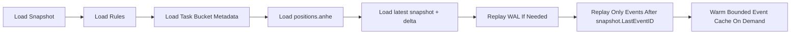
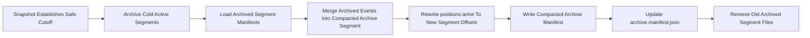
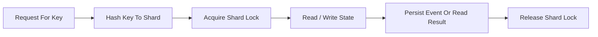
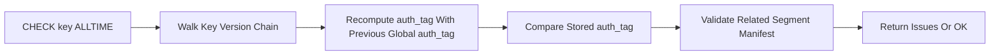
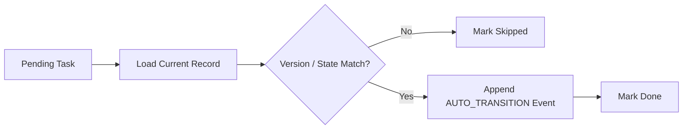
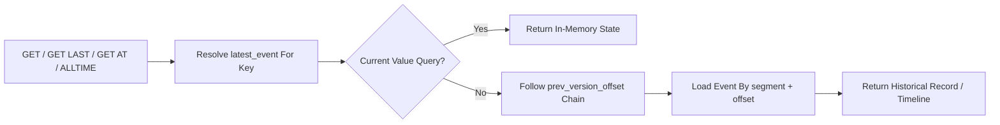
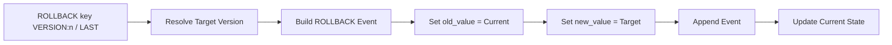
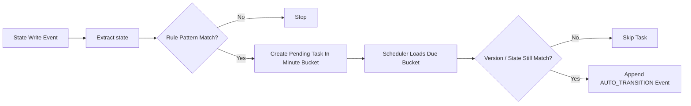

<h1 align="center">AnheBridgeDB</h1>

<p align="center">
  Evented KV store with version history, rollback, DSL, and rule-driven state transitions.
</p>

<p align="center">
  
</p>

<p align="center">
  This project is licensed under the Apache License 2.0.
</p>

<p align="center">
  <strong>Timeline. Diff. Rollback. Auto-transition.</strong>
</p>

<p align="center">
  <a href="https://github.com/paerx/anhebridgeDB">Live Demo</a>
  ·
  <a href="https://github.com/paerx/anhebridgeDB">DSL Playground</a>
  ·
  <a href="https://github.com/paerx/anhebridgeDB">Docs</a>
  ·

<a href="https://mail.google.com/mail/?view=cm&fs=1&to=realpaerpang@gmail.com">
  Contact me with Gmail
</a>
</p>

## Overview

## Contact

- Email: [realpaerpang@gmail.com](mailto:realpaerpang@gmail.com)
- GitHub: https://github.com/paerx

AnheBridgeDB v1 covers the current MVP path described in `docs/`:

- append-only segmented event log with compact per-event HMAC auth tag
- WAL + CRC-protected segment records + checkpoint-based recovery
- current-state index + historical timeline reconstruction
- `GET key`, `GET key AT ts`, `GET key ALLTIME`, `GET key ALLTIME WITH DIFF`
- `ROLLBACK key VERSION:n` and `ROLLBACK key VERSION:LAST`
- `CHECK key ALLTIME` tamper tracing
- DSL parser and execution endpoint
- rule engine with `CREATE RULE ... IF UNCHANGED FOR ... THEN TRANSITION`
- bucket-style persisted task queue and scheduler-driven auto transition
- snapshot + restart recovery for state, rules, and pending tasks

## Run

```bash
go run ./cmd/server -addr :8080 -data ./data -scheduler-interval 1s
```

## DSL Examples

```sql
SET userBalance:0xabc 100;
SET userBalance:0xabc -10 SEND i=tx-001;
SET userBalance:0xabc 10 RECEIVED i=tx-001;
ASET balance:123 -10 SEND i=tx-002, balance:456 10 RECEIVED i=tx-002;
GET userBalance:0xabc;
AGET userBalance:0xabc balance:123 balance:456;
GET userBalance:0xabc AT '2026-03-13T10:00:00Z';
GET userBalance:0xabc LAST;
GET userBalance:0xabc LAST -1 -1;
GET userBalance:0xabc ALLTIME;
GET userBalance:0xabc ALLTIME WITH DIFF;
GET userBalance:0xabc ALLTIME LIMIT 100 BEFORE VERSION:2000 AFTER VERSION:1500;
SEARCH EVENTS KEY:userBalance:0xabc NAME:SEND DESC LIMIT:20 PAGE:1;
SEARCH EVENTS I:tx-001;
SEARCH EVENTS KEY:userBalance:0xabc NAME:SEND WITH SAME I;
ROLLBACK userBalance:0xabc VERSION:5;
ROLLBACK userBalance:0xabc VERSION:LAST;
CHECK userBalance:0xabc ALLTIME;
CHECK userBalance:0xabc ALLTIME LIMIT 1000;
SNAPSHOT;
VERIFY STORAGE;
COMPACT STORAGE;

CREATE RULE auto_timeout_order
ON PATTERN "OrderStatus:*:wait_for_paid"
IF UNCHANGED FOR 15m
THEN TRANSITION TO "OrderStatus:{id}:timeout";

SHOW RULES;
SHOW RULE auto_timeout_order;
RUN SCHEDULER;
```

## Command Catalog

### Write Commands

```sql
SET key value;
SET key delta EVENT;
SET key value EVENT i=business-id;
ASET key value, key value EVENT, key value EVENT i=business-id;
DELETE key;
```

### Read Commands

```sql
GET key;
GET key RAW;
AGET key1 key2 key3;
AGET key1 key2 key3 RAW;
GET key AT '2026-03-15T04:00:00Z';
GET key LAST;
GET key LAST -1 -1;
GET key ALLTIME;
GET key ALLTIME WITH DIFF;
GET key ALLTIME LIMIT 100 BEFORE VERSION:10 AFTER VERSION:5;
```

### Super Value (Read-Only View)

`super value` means a string that starts with `*` and points to another key.

Example:

```sql
SET uid-hksn10 {"uid":"uid-hksn10","owner":"0xabc","activated":true};
SET uid-asan10 {"uid":"uid-asan10","owner":"0xdef","activated":false};
SET usersVape ["*uid-hksn10","*uid-asan10"];
GET usersVape;
GET usersVape RAW;
AGET usersVape uid-hksn10 RAW;
```

Behavior:

- `GET/AGET` expands super values by default.
- `GET RAW` and `AGET ... RAW` return stored raw value without expansion.
- expansion is read-only: no write-through to referenced keys.
- circular references are rejected with `super_value_cycle_detected`.
- depth/node/fanout are bounded by performance config.
- missing referenced key is returned as `found=false` entry, not a server crash.

### Search Commands

```sql
SEARCH EVENTS KEY:balance:1234 NAME:SEND;
SEARCH EVENTS KEY:balance:1234 NAME:SEND DESC LIMIT:20 PAGE:1;
SEARCH EVENTS I:abcd;
SEARCH EVENTS KEY:balance:1234 NAME:SEND WITH SAME I;
```

Search behavior:

- `NAME:` filters by event name using the secondary event-name index
- `I:` filters by `idempotency_key`
- `WITH SAME I` expands the matched result set to every event that shares the same business idempotency key
- `PAGE:n` performs direct page slicing on the indexed result set

### Recovery And Integrity Commands

```sql
ROLLBACK key VERSION:5;
ROLLBACK key VERSION:LAST;
CHECK key ALLTIME;
CHECK key ALLTIME LIMIT 1000;
SNAPSHOT;
VERIFY STORAGE;
COMPACT STORAGE;
```

### Rule Commands

```sql
CREATE RULE auto_timeout_order
ON PATTERN "OrderStatus:*:wait_for_paid"
IF UNCHANGED FOR 15m
THEN TRANSITION TO "OrderStatus:{id}:timeout";

SHOW RULES;
SHOW RULE auto_timeout_order;
RUN SCHEDULER;
```

Segment rolling is configurable in [config.json](/Users/pangaichen/Desktop/AnheBridageDB/config/config.json):

```json
{
  "auth": {
    "enabled": false,
    "token_ttl_minutes": 1440,
    "users": [
      {
        "username": "admin",
        "password": "change-me"
      }
    ]
  },
  "storage": {
    "strict_recovery": false,
    "segment": {
      "max_bytes": 67108864,
      "max_records": 30000
    }
  }
}
```

Both thresholds can be enabled together. A segment rolls when either limit is exceeded.

To enable auth for dashboard and CLI, set:

```json
{
  "auth": {
    "enabled": true,
    "token_ttl_minutes": 1440,
    "users": [
      {
        "username": "admin",
        "password": "change-me"
      }
    ]
  }
}
```

You can also set `ANHEBRIDGE_AUTH_SECRET` in the environment to override the token signing secret.

Performance controls:

```json
{
  "performance": {
    "event_cache_max_items": 50000,
    "event_cache_max_bytes": 134217728,
    "key_index_compact_ops": 10000,
    "scheduler_workers": 4,
    "metrics_sample_interval_seconds": 10,
    "snapshot_batch_size": 10000,
    "timeline_default_limit": 1000,
    "super_value_max_depth": 5,
    "super_value_max_fanout": 200,
    "super_value_max_nodes": 1000
  }
}
```

`metrics_sample_interval_seconds` is clamped to `>= 10s` so metrics history sampling stays off the hot path.

Client:

```bash
go run ./cmd/client -addr http://127.0.0.1:8080
```

CLI login:

```text
anhe> login
username: admin
password: change-me
```

The CLI stores the bearer token in `~/.anhebridge_cli_auth.json` and automatically attaches it to future requests for the same server address.

Single command:

```bash
go run ./cmd/client -addr http://127.0.0.1:8080 -e 'GET user:1 ALLTIME WITH DIFF;'
```

Pipe input:

```bash
printf 'SHOW RULES;\n' | go run ./cmd/client -addr http://127.0.0.1:8080
```

Stress test:

```bash
go run ./cmd/stress -addr http://127.0.0.1:8080 -mode rw -duration 60s -workers 16 -batch 64 -keys 20000
go run ./cmd/stress -addr http://127.0.0.1:8080 -mode orders -orders 20000 -order-batch 200 -workers 8 -rule-delay 15s
go run ./cmd/stress -addr http://127.0.0.1:8080 -mode mixed -duration 90s -workers 16 -orders 10000
```

For an M4 / 16GB machine, a practical starting point is:

```bash
go run ./cmd/server -addr :8080 -data ./data -scheduler-interval 500ms
go run ./cmd/stress -addr http://127.0.0.1:8080 -mode mixed -duration 120s -workers 16 -batch 128 -keys 50000 -orders 20000 -order-batch 200 -rule-delay 15s
```

## API

When auth is enabled, all endpoints except `/healthz` and `/auth/login` require:

```bash
-H 'Authorization: Bearer <token>'
```

Login:

```bash
curl -X POST http://localhost:8080/auth/login \
  -H 'Content-Type: application/json' \
  -d '{"username":"admin","password":"change-me"}'
```

Write:

```bash
curl -X PUT http://localhost:8080/kv/user:1 \
  -H 'Content-Type: application/json' \
  -d '{"name":"tom","state":"active"}'
```

Read latest:

```bash
curl http://localhost:8080/kv/user:1
```

Read at time:

```bash
curl 'http://localhost:8080/kv/user:1?time=2026-03-14T03:00:00Z'
```

Timeline:

```bash
curl http://localhost:8080/kv/user:1/timeline
```

Timeline with diff:

```bash
curl 'http://localhost:8080/kv/user:1/timeline?diff=true'
```

Timeline window:

```bash
curl 'http://localhost:8080/kv/user:1/timeline?limit=100&before_version=2000&after_version=1500'
```

Delete:

```bash
curl -X DELETE http://localhost:8080/kv/user:1
```

Create snapshot:

```bash
curl -X POST http://localhost:8080/snapshot
```

Stats:

```bash
curl http://localhost:8080/stats
```

Metrics:

```bash
curl http://localhost:8080/metrics
```

Metrics history OHLC:

```bash
curl "http://localhost:8080/metrics/history?metrics=heap_alloc_bytes,pending_tasks&from=2026-03-15T12:00:00Z&to=2026-03-15T13:00:00Z&bucket=1m"
```

Debug perf:

```bash
curl http://localhost:8080/debug/perf
```

Verify storage:

```bash
curl -X POST http://localhost:8080/admin/verify
```

Compact storage:

```bash
curl -X POST http://localhost:8080/admin/compact
```

Export full backup tarball:

```bash
curl http://localhost:8080/admin/export?scope=full -o anhebridgedb-full.tar.gz
```

Export selected segments tarball:

```bash
curl "http://localhost:8080/admin/export?scope=segments&segments=segment_000001.anhe,segment_900001.anhe" -o anhebridgedb-segments.tar.gz
```

Import backup tarball:

```bash
curl -X POST "http://localhost:8080/admin/import?scope=full" \
  -H 'Content-Type: application/gzip' \
  --data-binary @anhebridgedb-full.tar.gz
```

Import selected segments tarball:

```bash
curl -X POST "http://localhost:8080/admin/import?scope=segments" \
  -H 'Content-Type: application/gzip' \
  --data-binary @anhebridgedb-segments.tar.gz
```

WebSocket:

```text
ws://localhost:8080/ws?token=<bearer-token>
```

Example messages:

```json
{"type":"exec","request_id":"1","query":"SHOW METRICS;"}
{"type":"subscribe","topic":"metrics","interval_seconds":10}
{"type":"subscribe","topic":"stats","interval_seconds":30}
{"type":"unsubscribe","topic":"metrics"}
{"type":"ping"}
```

Create rule:

```bash
curl -X POST http://localhost:8080/rules \
  -H 'Content-Type: application/json' \
  -d '{
    "id":"auto_timeout_order",
    "pattern":"OrderStatus:*:wait_for_paid",
    "delay":"15m",
    "target":"OrderStatus:{id}:timeout"
  }'
```

Execute DSL:

```bash
curl -X POST http://localhost:8080/dsl \
  -H 'Content-Type: application/json' \
  -d '{
    "query":"SET OrderStatus:123 {\"state\":\"wait_for_paid\",\"amount\":100}; GET OrderStatus:123 ALLTIME WITH DIFF;"
  }'
```

## Data Layout

```text
data/
  log/segment_000001.anhe
  log/segment_000002.anhe
  log/segment_000001.manifest.json
  log/segment_000002.manifest.json
  log/events.wal
  log/checkpoint.json
  log/archive/segment_000001.anhe
  log/archive/segment_000001.manifest.json
  log/archive/archive.manifest.json
  log/archive/segment_900001.anhe
  log/archive/segment_900001.manifest.json
  index/positions.anhe
  index/latest.snapshot.anhe
  index/latest.delta.anhe
  snapshot/latest.json
  system/rules.json
  system/task_buckets/202603140445.anhe
  system/task_buckets/202603140446.anhe
```

## Storage Model

AnheBridgeDB stores data as an append-only event stream plus a small set of persisted indexes:

- `log/segment_xxxxxx.anhe`
  - append-only event segments
  - each event record is wrapped with CRC32
  - each event stores `event_id`, `key`, `operation`, `old_value`, `new_value`, `prev_version_offset`, compact `auth_tag`, and metadata
- `log/segment_xxxxxx.manifest.json`
  - per-segment manifest
  - stores segment-level counters, time range, event-id range, first/last auth tags, and rolling manifest auth
- `log/events.wal`
  - write-ahead log for crash recovery before segment/index/manifest flush completes
- `log/checkpoint.json`
  - stores `next_id`, `current_segment`, and latest auth-chain head
- `log/archive/`
  - cold segments moved out of the active write path while remaining readable for history queries
  - archive compaction can merge many cold segments into a compacted archive segment
  - `archive.manifest.json` records archived and compacted segment lineage
- `index/positions.anhe`
  - persistent position index
  - maps `event_id -> segment + file offset + size`
- `index/latest.snapshot.anhe` + `index/latest.delta.anhe`
  - compact snapshot plus append-only delta log
  - maps `key -> latest_event`
- `snapshot/latest.json`
  - full state snapshot for restart recovery
- `system/rules.json`
  - rule definitions and counters
- `system/task_buckets/*.anhe`
  - minute-bucket task files for delayed transitions

### Write Path

```mermaid
flowchart LR
  A["DSL / HTTP Write"] --> B["Lock Key Shard"]
  B --> C["Build Event"]
  C --> D["Write WAL"]
  D --> E["Append To Segment"]
  E --> F["Append Position Index"]
  F --> G["Update Manifest + Checkpoint"]
  G --> H["Clear WAL"]
  H --> I["Update latest index In Memory"]
  I --> J["Apply Current State"]
  J --> K["Rule Match"]
  K --> L["Persist Task Bucket If Needed"]
```



### Recovery Path



### Archive Compaction Path



## Locking Model

The runtime uses sharded key locks instead of a single global KV lock:

- the same key is always serialized
- different keys can be read and written in parallel
- batch operations lock involved key shards in sorted order to avoid deadlocks
- event log append is serialized internally so `event_id` ordering stays stable
- metadata persistence such as latest-index delta flush is serialized separately

### Lock Flow



## Idempotency Model

The rule engine is designed around version checks, not blind timers.

- each scheduled task stores:
  - `entity_key`
  - `expected_version`
  - `expected_state`
  - `cause_event_id`
- when the scheduler executes a task, it first validates that the current record still matches the captured version and state
- if the key has changed since task creation, the task is marked `skipped`
- if the key is unchanged, a new `AUTO_TRANSITION` event is appended

This makes delayed transitions naturally idempotent at the state-machine level.

## Tamper Detection

Each event is written with:

- `auth_tag`
  - compact HMAC-SHA256 tag
  - calculated from the current event payload plus the previous global event's `auth_tag`

This forms a chained HMAC proof with only one extra field per event. If someone edits an old event directly on disk without the signing secret, `CHECK key ALLTIME` will surface the mismatch.

CRC adds a second protection layer:

- direct record corruption or partial writes are detected before event decoding
- strict recovery mode can refuse startup on CRC / manifest / auth-chain mismatch

Segment manifests add another verification layer:

- first / last event id
- first / last `auth_tag`
- record count
- rolling `manifest_auth`

### Tamper Check Flow



### Idempotent Task Execution



## Read Path

Reads use different strategies depending on the query type:

- `GET key`
  - returns current state directly from the in-memory state map
- `GET key LAST`
  - starts from `latest_event`
  - follows `prev_version_offset`
- `GET key ALLTIME`
  - walks the same version chain until the first version
- `GET key AT ts`
  - walks the per-key version chain backward until it finds the first event at or before the target timestamp
- if an event body is not already cached, it is loaded from `segment + offset` through `positions.anhe`
- event bodies live in a bounded cache instead of unbounded in-memory growth

### Read Flow



## Rollback Model

Rollback never deletes history. It appends a new event that points back to a previous version.

- `ROLLBACK key VERSION:n`
  - finds the target event
  - appends a new `ROLLBACK` event
  - sets `new_value` to the target version's value
- `ROLLBACK key VERSION:LAST`
  - resolves the previous version automatically
  - then appends the same kind of rollback event

This keeps the audit trail complete and makes rollback itself queryable in timeline history.

### Rollback Flow



## Rule Engine

Rules are pattern-based delayed transitions.

Example:

```sql
CREATE RULE auto_timeout_order
ON PATTERN "OrderStatus:*:wait_for_paid"
IF UNCHANGED FOR 15m
THEN TRANSITION TO "OrderStatus:{id}:timeout";
```

Internal flow:

- a write updates a key such as `OrderStatus:123`
- the rule engine extracts the current state from the event value
- if the pattern matches, it creates a delayed task in the target minute bucket
- the scheduler later loads due buckets and validates the task
- if still valid, worker threads append an `AUTO_TRANSITION` event while same-key writes remain serialized

## Observability

The server now exposes:

- `/stats`
  - logical state overview
- `/metrics`
  - heap usage
  - GC pause totals
  - event cache size and hit ratio
  - get/get-at/timeline/check latency percentiles
  - set/aset/append/latest-index-flush latency percentiles
  - scheduler backlog and overdue task counts
  - segment/index/snapshot/manifest sizes
  - recovery timings
  - append / latest-index flush timings
- `/debug/perf`
  - bucket backlog detail
  - segment manifests
  - event cache state
  - consolidated perf snapshot
- `/admin/verify`
  - validates manifests
  - validates chained HMAC auth tags
  - surfaces storage integrity issues before they become silent corruption
- `/admin/compact`
  - compacts latest index delta into snapshot
  - clears old fully-terminal task buckets
  - archives cold segments covered by snapshot state
- `/admin/export`
  - streams a `.tar.gz` backup package
  - supports `scope=full`
  - supports `scope=segments&segments=segment_000001.anhe,...`
- `/admin/import`
  - imports a `.tar.gz` backup package
  - rebuilds `positions.anhe` and latest key index after import
  - returns `restart_required: true` because in-memory state is not hot-reloaded

### Rule Match And Transition Flow


